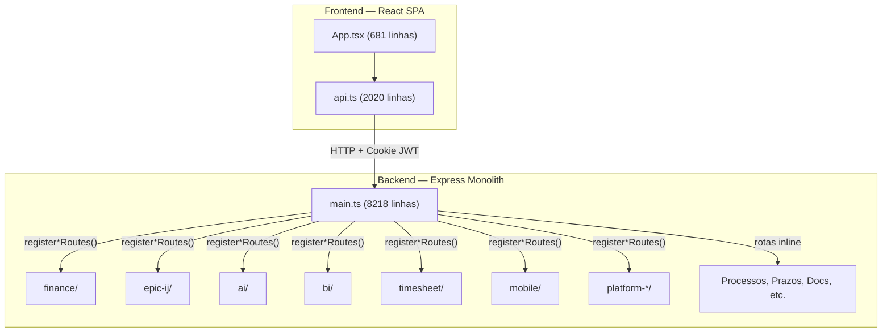
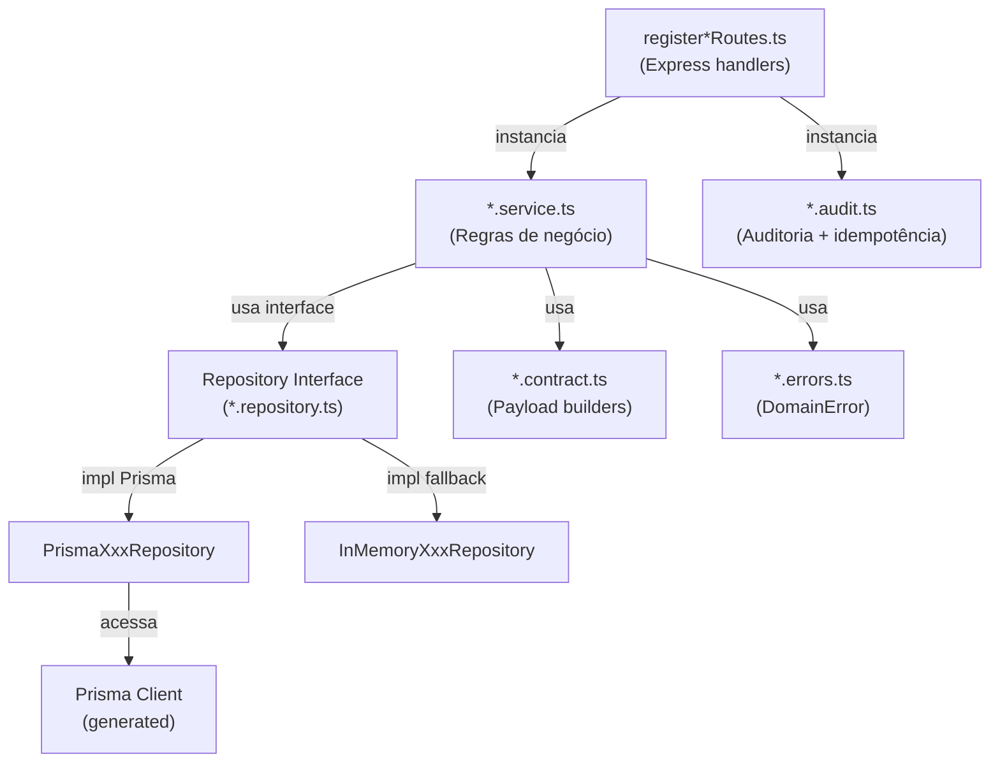

# Lexora — Arquitetura e Convenções

> Skill: define as regras arquiteturais, padrões de extração de módulos, camadas de serviço/repositório e convenções de importação do monolito Lexora.

---

## 1. Propósito

Guia para agentes e desenvolvedores sobre:
- Como está organizado o monolito e como extrair módulos
- Padrão Service → Repository → Prisma usado em todo o backend
- Regras de importação e dependência entre camadas
- Convenções de nomeação, diretórios e barrel exports

---

## 2. Visão Geral do Monolito



### 2.1 Estado Atual

| Camada | Arquivo Principal | Linhas | Status |
|--------|------------------|--------|--------|
| Backend entry | [main.ts](file:///c:/Users/tomke/app%20Juridico/backend/src/main.ts) | 8218 | Monolito com rotas inline + register*Routes |
| Frontend entry | [App.tsx](file:///c:/Users/tomke/app%20Juridico/frontend/src/App.tsx) | 681 | SPA com lazy routes |
| Frontend API | [api.ts](file:///c:/Users/tomke/app%20Juridico/frontend/src/api.ts) | 2020 | Interfaces + apiClient + api object |
| Auth | [auth.ts](file:///c:/Users/tomke/app%20Juridico/backend/src/auth.ts) | 31 | JWT sign/verify |
| Tokens CSS | [tokens.css](file:///c:/Users/tomke/app%20Juridico/frontend/src/tokens.css) | 625 | Design tokens centralizados |

---

## 3. Módulos Extraídos

Cada módulo extraído segue o padrão `register*Routes()`. Aqui está a lista completa:

| Módulo | Diretório Backend | Entry Point | Dependências injetadas |
|--------|-------------------|-------------|----------------------|
| Finance | [finance/](file:///c:/Users/tomke/app%20Juridico/backend/src/finance) | [register-finance-routes.ts](file:///c:/Users/tomke/app%20Juridico/backend/src/finance/http/register-finance-routes.ts) | `app, prisma, getUserFromReq, devMockEnabled` |
| Epic IJ | [epic-ij/](file:///c:/Users/tomke/app%20Juridico/backend/src/epic-ij) | [register-epic-ij-routes.ts](file:///c:/Users/tomke/app%20Juridico/backend/src/epic-ij/register-epic-ij-routes.ts) | `app, prisma, getUserFromReq` |
| AI | [ai/](file:///c:/Users/tomke/app%20Juridico/backend/src/ai) | [register-ai-routes.ts](file:///c:/Users/tomke/app%20Juridico/backend/src/ai/http/register-ai-routes.ts) | `app, getUserFromReq` |
| BI | [bi/](file:///c:/Users/tomke/app%20Juridico/backend/src/bi) | [register-bi-routes.ts](file:///c:/Users/tomke/app%20Juridico/backend/src/bi/api/register-bi-routes.ts) | `app, getUserFromReq, services, loaders` |
| Timesheet | [timesheet/](file:///c:/Users/tomke/app%20Juridico/backend/src/timesheet) | `register-timesheet-routes.ts` | `app, getUserFromReq, repository` |
| Mobile | [mobile/](file:///c:/Users/tomke/app%20Juridico/backend/src/mobile) | `register-mobile-routes.ts` | `app, prisma, getUserFromReq, repository` |
| Platform Actions | [platform-actions/](file:///c:/Users/tomke/app%20Juridico/backend/src/platform-actions) | `register-platform-actions-routes.ts` | `app, prisma, getUserFromReq` |
| Platform Billing | [platform-billing/](file:///c:/Users/tomke/app%20Juridico/backend/src/platform-billing) | `register-platform-billing-routes.ts` | `app, prisma, getUserFromReq` |
| Platform Console | [platform/](file:///c:/Users/tomke/app%20Juridico/backend/src/platform) | `register-platform-console-routes.ts` | `app, prisma, getUserFromReq` |

### 3.1 Módulos Ainda no main.ts (legado)

Rotas ainda inline no monolito:
- Processos (`/processes`, `/processes/:id`)
- Prazos (`/deadlines`, `/deadlines/:id`)
- Documentos (`/documents`, `/documents/:id`)
- Publicações (`/publications`)
- Triagem (`/triage`)
- CRM (`/crm/*`)
- Clientes (`/clients`)
- Atendimentos (`/attendances`)
- Agenda (`/agenda/*`)
- Modelos/Templates (`/templates`)
- Usuários (`/users`)

> [!TIP]
> Ao trabalhar nessas rotas, **extraia para um `register*Routes()`** no diretório do módulo. Nunca adicione mais código ao main.ts.

---

## 4. Padrão de Extração de Módulo

### 4.1 Estrutura de Diretório

Cada módulo extraído deve seguir esta estrutura:
```
backend/src/<modulo>/
├── http/
│   └── register-<modulo>-routes.ts    # Entry point com rotas Express
├── core/
│   ├── <entidade>.types.ts            # Tipos e interfaces
│   ├── <entidade>.errors.ts           # Classes de erro do domínio
│   └── <entidade>-audit.ts            # Audit service
├── <subdominio>/
│   ├── <entidade>.service.ts          # Lógica de negócio
│   └── <entidade>.repository.ts       # Acesso a dados (interface + impls)
├── shared/
│   ├── index.ts                       # Barrel de re-exports
│   ├── types.ts                       # Tipos compartilhados do módulo
│   ├── errors.ts                      # Erro base do módulo
│   └── audit.ts                       # Audit service base
└── <contrato>.contract.ts             # Builders de payload p/ frontend
```

**Exemplo real — módulo Finance:**
```
backend/src/finance/
├── http/register-finance-routes.ts     ← Entry point
├── accounts/finance-entry.repository.ts
├── billing/billing.service.ts
├── categories/finance-category.repository.ts
├── collections/finance-collections.service.ts
├── delinquency/delinquency-contacts.service.ts
├── installments/finance-installment-plan.service.ts
├── ledger/finance-entry.service.ts
├── payment-links/http-payment-provider.ts
├── payment-links/mock-payment-provider.ts
├── reconciliation/reconciliation.service.ts
├── reports/aging-report.service.ts
├── reports/cashflow-report.service.ts
├── shared/
│   ├── index.ts                        ← export * from './audit', './errors', './types'
│   ├── audit.ts
│   ├── errors.ts
│   └── types.ts
└── webhooks/finance-webhook.service.ts
```

### 4.2 Assinatura da Função registerRoutes

```typescript
// Padrão canônico
export function registerMyModuleRoutes(input: {
  app: express.Express;
  prisma: any;                          // Prisma Client
  getUserFromReq: (req: express.Request) => {
    sub: number;
    role: string;
    email: string;
  } | null;
  devMockEnabled?: boolean;             // Opcional: ativa fallback InMemory
}) {
  // 1. Instancia serviços e repositórios
  // 2. Define helper de autenticação/autorização
  // 3. Registra rotas
}
```

> [!IMPORTANT]
> O `prisma` é injetado como `any` — isso é intencional para evitar importação cíclica do PrismaClient gerado. Cada repository que usa Prisma faz seu cast interno.

### 4.3 Registrando no main.ts

Sempre no final do arquivo, antes de `app.listen()`:
```typescript
import { registerMyModuleRoutes } from './mymodule/http/register-mymodule-routes';

// ... (final do main.ts, junto com os outros register*)
registerMyModuleRoutes({ app, prisma, getUserFromReq });
```

---

## 5. Padrão Service → Repository → Prisma

### 5.1 Repository (Camada de Dados)

Cada repositório é uma **interface TypeScript** com duas implementações:

```typescript
// Interface — define o contrato
export interface FinanceEntryRepository {
  create(input: FinanceEntryCreateInput): Promise<FinanceEntryRow>;
  update(entryId: number, data: Partial<FinanceEntryCreateInput>): Promise<FinanceEntryRow>;
  findById(entryId: number): Promise<FinanceEntryRow | null>;
  list(filters?: { type?: string; status?: string }): Promise<FinanceEntryRow[]>;
  assertClientExists(clientId: number | null): Promise<void>;
}

// Implementação Prisma — usada em produção
export class PrismaFinanceEntryRepository implements FinanceEntryRepository {
  constructor(private readonly prisma: any) {}

  private include = {
    category: true,
    charges: { orderBy: { createdAt: 'desc' }, take: 1 },
    clientRecord: { select: { id: true, name: true, email: true, phone: true } },
  };

  async create(input: FinanceEntryCreateInput) {
    return this.prisma.financeEntry.create({ data: input, include: this.include });
  }
}

// Implementação InMemory — usada como fallback quando DB indisponível
export class InMemoryFinanceEntryRepository implements FinanceEntryRepository {
  private readonly entries = new Map<number, FinanceEntryRow>();
  private sequence = 1;

  async create(input: FinanceEntryCreateInput) {
    const row = { id: this.sequence++, ...input, charges: [] };
    this.entries.set(row.id, row);
    return row;
  }
}
```

> [!NOTE]
> A implementação `InMemory` serve para **desenvolvimento sem banco** — o `withFallback()` na camada de rotas tenta Prisma primeiro e, em caso de `PrismaClientInitializationError`, usa InMemory.

### 5.2 Service (Camada de Negócio)

O service recebe repositórios e audit service via construtor (injeção manual):

```typescript
export class FinanceEntryService {
  constructor(
    private readonly dependencies: {
      repository: FinanceEntryRepository;      // Interface, não classe concreta
      categories: FinanceCategoryRepository;
      auditService: FinanceAuditService;
      now?: () => Date;                         // Injetável p/ testes
    },
  ) {}

  async createEntry(input: { ... }, actor: FinanceActor) {
    // 1. Validação de negócio
    if (!input.description || input.amountCents <= 0) {
      throw new FinanceDomainError('Lançamento inválido', 400, 'FIN_ENTRY_INVALID');
    }
    // 2. Verificação de relações
    await this.dependencies.categories.findByCode(input.categoryCode);
    // 3. Execução idempotente
    const result = await this.dependencies.auditService.runIdempotent({
      key: input.idempotencyKey,
      scope: 'finance.entry.create',
      execute: async () => { ... },
    });
    // 4. Auditoria
    const auditEvent = await this.dependencies.auditService.record({ ... });
    // 5. Retorno com builder de payload
    return { entry: result.data, auditEvent, idempotency: result.mode };
  }
}
```

### 5.3 Contract / Payload Builder

Cada módulo tem um `*.contract.ts` que transforma rows em payloads para o frontend:

```typescript
// backend/src/finance.contract.ts
export function buildFinanceEntryPayload(row: FinanceEntryRow) {
  return {
    id: row.id,
    type: row.type,
    status: row.status,
    description: row.description,
    amountCents: row.amountCents,
    dueDate: row.dueDate instanceof Date
      ? row.dueDate.toISOString().slice(0, 10)
      : row.dueDate,
    clientName: row.clientRecord?.name ?? null,
    categoryLabel: row.category?.label ?? row.categoryCode,
    // ... campos derivados
  };
}
```

Contratos existentes:
- [finance.contract.ts](file:///c:/Users/tomke/app%20Juridico/backend/src/finance.contract.ts) — Finance entries, charges, audit events
- [tasks.contract.ts](file:///c:/Users/tomke/app%20Juridico/backend/src/tasks.contract.ts) — Tasks
- [deadlines.contract.ts](file:///c:/Users/tomke/app%20Juridico/backend/src/deadlines.contract.ts) — Deadlines
- [documents.contract.ts](file:///c:/Users/tomke/app%20Juridico/backend/src/documents.contract.ts) — Documents
- [publications.contract.ts](file:///c:/Users/tomke/app%20Juridico/backend/src/publications.contract.ts) — Publications
- [crm.contract.ts](file:///c:/Users/tomke/app%20Juridico/backend/src/crm.contract.ts) — CRM Leads, Opportunities
- [triage.contract.ts](file:///c:/Users/tomke/app%20Juridico/backend/src/triage.contract.ts) — Triage items, jobs
- [agenda.contract.ts](file:///c:/Users/tomke/app%20Juridico/backend/src/agenda.contract.ts) — Agenda events
- [templates.contract.ts](file:///c:/Users/tomke/app%20Juridico/backend/src/templates.contract.ts) — Templates

### 5.4 Diagrama de Camadas



---

## 6. Convenções de Importação

### 6.1 Barrel Exports (shared/index.ts)

Cada módulo exporta seus tipos públicos via barrel:
```typescript
// finance/shared/index.ts
export * from './audit';
export * from './errors';
export * from './types';
```

### 6.2 Imports entre Módulos

| De | Para | Permitido? |
|----|------|-----------|
| Routes → Service | Mesmo módulo | ✅ Sim |
| Service → Repository | Mesmo módulo | ✅ Sim (via interface) |
| Service → Contract Builder | Módulo pai (`../../finance.contract`) | ✅ Sim |
| Service → DomainError | `../shared` | ✅ Sim |
| Módulo A → Módulo B types | `../../moduloB/shared` | ⚠️ Somente tipos/interfaces |
| Módulo A → Módulo B service | Direto | ❌ Não — use injeção no registerRoutes |
| Qualquer → main.ts | — | ❌ Nunca |
| Routes → Prisma Client | Direto | ❌ Não — use Repository |

### 6.3 Padrão de Import Real

```typescript
// Dentro de finance/ledger/finance-entry.service.ts
import { buildFinanceEntryPayload } from '../../finance.contract';          // Contract builder
import { assertCategoryMatchesType, type FinanceCategoryRepository } from '../categories/finance-category.repository';
import type { FinanceEntryRepository } from '../accounts/finance-entry.repository';
import { FinanceAuditService, FinanceDomainError, type FinanceActor } from '../shared'; // Barrel
```

```typescript
// Dentro de epic-ij/register-epic-ij-routes.ts
import { buildTaskPayload } from '../tasks.contract';
import { type AttendanceAggregate, buildLegacyAttendancePayload } from '../attendances/core/attendance.model';
import { ensureAuthorized, AuthzForbiddenError } from '../authz/guards/authz.guard';
import { ManagementAuditService } from '../audit/team';
import { TeamOwnershipService } from '../team';
```

---

## 7. Frontend — Estrutura de Componentes

### 7.1 Lazy Routes no App.tsx

```typescript
const Dashboard = lazy(() => import('./dashboard/product/ui/DashboardPage').then(m => ({ default: m.DashboardPage })))
const Processes = lazy(() => import('./Processes').then(m => ({ default: m.Processes })))
const Financeiro = lazy(() => import('./Financeiro').then(m => ({ default: m.Financeiro })))
// ...
```

### 7.2 Componentes UI (Radix UI)

Componentes primitivos em [components/ui/](file:///c:/Users/tomke/app%20Juridico/frontend/src/components/ui):
- Button, Input, Textarea, Badge, Separator
- Dialog, Sheet, DropdownMenu, Tabs, Popover, ScrollArea, Tooltip, Select
- Barrel export em [index.ts](file:///c:/Users/tomke/app%20Juridico/frontend/src/components/ui/index.ts)
- Estilos em [styles.css](file:///c:/Users/tomke/app%20Juridico/frontend/src/components/ui/styles.css)

### 7.3 Diretórios de Features

```
frontend/src/components/
├── access-state/       # Banner de estado de acesso da empresa
├── audit/              # Componentes de auditoria
├── auth/               # Login, proteção de rotas
├── clients/            # Gestão de clientes
├── communication/      # Comunicação multicanal
├── company/            # Contexto de empresa
├── company-status/     # Status da empresa
├── crm/                # CRM jurídico
├── deadlines/          # Prazos
├── finance/            # Financeiro
├── permissions/        # Gestão de permissões
├── platform/           # Plataforma admin
├── platform-admin/     # Console de admin
├── platform-billing/   # Billing da plataforma
├── product/            # Produto (features avançadas)
├── publications/       # Publicações
├── read-only/          # Modo somente leitura
├── team/               # Equipes
├── timeline/           # Timeline de ações
└── ui/                 # Primitivos Radix
```

---

## 8. Prisma Schema

O schema Prisma está em [prisma/schema.prisma](file:///c:/Users/tomke/app%20Juridico/prisma/schema.prisma) (raiz do projeto). Há variantes em:
- [backend/prisma/schema.prisma](file:///c:/Users/tomke/app%20Juridico/backend/prisma/schema.prisma) — PostgreSQL
- [backend/prisma-postgres/schema.prisma](file:///c:/Users/tomke/app%20Juridico/backend/prisma-postgres/schema.prisma) — PostgreSQL alternativo
- [backend/prisma-sqlite-legacy/schema.prisma](file:///c:/Users/tomke/app%20Juridico/backend/prisma-sqlite-legacy/schema.prisma) — SQLite legado

> [!WARNING]
> Sempre verifique qual schema está sendo usado pelo `DATABASE_URL`. O schema principal está na raiz `prisma/` mas o backend pode apontar para `backend/prisma/`.

---

## 9. Anti-Padrões

> [!CAUTION]
> **NÃO FAÇA:**
> - Adicionar novas rotas inline no `main.ts` — sempre crie um `register*Routes()`
> - Importar classes concretas de Repository no Service — use interfaces
> - Acessar `prisma` diretamente no handler da rota — passe pelo Service
> - Criar módulos que importam de `main.ts`
> - Fazer imports circulares entre módulos de negócio
> - Colocar lógica de negócio na camada de Routes
> - Usar `new PrismaClient()` fora do main.ts
> - Omitir a implementação InMemory quando o módulo precisa funcionar offline
> - Chamar services de outro módulo diretamente — injete via `registerRoutes`

---

## 10. Checklist para Novo Módulo

- [ ] Diretório criado em `backend/src/<modulo>/`
- [ ] `register<Modulo>Routes()` criada com assinatura padrão
- [ ] Repository com interface + PrismaImpl + InMemoryImpl
- [ ] Service usando injeção via construtor
- [ ] DomainError com `code`, `statusCode`, `details`
- [ ] Contract builder (`build*Payload()`) para o frontend
- [ ] Barrel export em `shared/index.ts`
- [ ] Chamada `register*Routes()` no final de `main.ts`
- [ ] Interface TypeScript adicionada ao `api.ts`
- [ ] Imports seguem as regras de dependência
- [ ] Testes com InMemory repos (quando aplicável)
