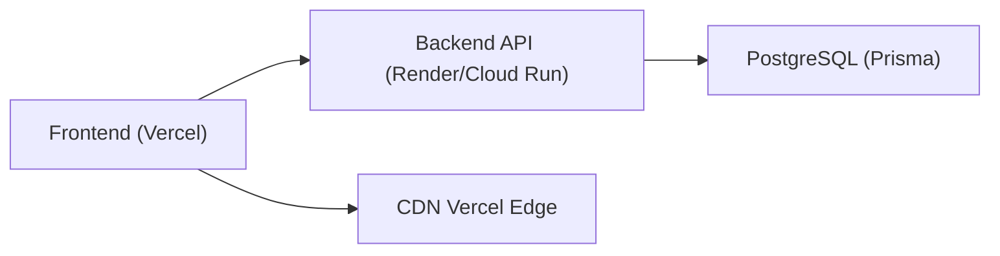

# Lexora — Deploy e Infraestrutura

## Propósito

Documentar os fluxos de deploy do frontend (Vercel) e backend (Cloud Run / Render), gerenciamento de migrações Prisma, variáveis de ambiente e procedimentos de rollback.

---

## 1. Infraestrutura Atual

### 1.1 Visão Geral



| Componente | Plataforma | URL Staging | URL Produção |
|-----------|-----------|-------------|-------------|
| Frontend | Vercel | Preview automático por branch | `lexora.cloud` / `www.lexora.cloud` |
| Backend | Render (staging) | `juridico-api-staging.onrender.com` | `api.lexora.cloud` |
| Banco de dados | PostgreSQL | Schema prisma/schema.postgres.prisma | Mesmo schema |

### 1.2 Configuração Vercel — Raiz

[vercel.json](file:///c:/Users/tomke/app%20Juridico/vercel.json) (raiz do monorepo):

```json
{
  "installCommand": "npm ci && npm --prefix frontend ci",
  "buildCommand": "VITE_API_URL=https://juridico-api-staging.onrender.com npm run frontend:build",
  "outputDirectory": "frontend/dist",
  "rewrites": [{ "source": "/(.*)", "destination": "/index.html" }]
}
```

### 1.3 Configuração Vercel — Frontend

[frontend/vercel.json](file:///c:/Users/tomke/app%20Juridico/frontend/vercel.json) (configuração avançada com staging/prod):

```json
{
  "version": 2,
  "name": "lexora-juridico-frontend",
  "alias": ["lexora.cloud", "www.lexora.cloud"],
  "env": [
    { "key": "VITE_API_URL", "value": "https://api-staging.lexora.cloud", "target": ["preview"] },
    { "key": "VITE_API_URL", "value": "https://api.lexora.cloud", "target": ["production"] },
    { "key": "VITE_SENTRY_DSN", "value": "https://YOUR_SENTRY_KEY@sentry.io/YOUR_PROJECT_ID" },
    { "key": "VITE_GA_MEASUREMENT_ID", "value": "G-XXXXXXXXXX" }
  ],
  "framework": "vite",
  "outputDirectory": "dist",
  "regions": ["sao1", "gru1"],
  "git": {
    "deploymentEnabled": { "main": true, "develop": true }
  }
}
```

### 1.4 Headers de segurança (ambos vercel.json)

Ambas as configurações incluem headers de segurança:

| Header | Valor |
|--------|-------|
| `Cache-Control` | `public, max-age=3600, must-revalidate` |
| `X-Frame-Options` | `SAMEORIGIN` |
| `X-Content-Type-Options` | `nosniff` |
| `Referrer-Policy` | `strict-origin-when-cross-origin` |
| `X-XSS-Protection` | `1; mode=block` (somente frontend/vercel.json) |

---

## 2. Frontend Deploy (Vercel)

### 2.1 Build Command

```powershell
# Localmente
cd frontend
npm run build   # executa "tsc -b && vite build"

# Via Vercel (automático)
# installCommand: npm ci && npm --prefix frontend ci
# buildCommand: VITE_API_URL=<url> npm run frontend:build
```

### 2.2 Output

- Diretório: `frontend/dist`
- Framework: Vite
- SPA rewrite: `/(.*) → /index.html`
- API proxy (prod): `/api/(.*) → https://api.lexora.cloud/$1`

### 2.3 Variáveis de Ambiente do Frontend

| Variável | Staging | Produção | Descrição |
|----------|---------|----------|-----------|
| `VITE_API_URL` | `https://api-staging.lexora.cloud` | `https://api.lexora.cloud` | URL base da API |
| `VITE_SENTRY_DSN` | DSN do Sentry | DSN do Sentry | Monitoramento de erros |
| `VITE_GA_MEASUREMENT_ID` | ID do GA4 | ID do GA4 | Analytics |

> [!IMPORTANT]
> Variáveis `VITE_*` são injetadas **em build time** pelo Vite. Mudanças requerem rebuild.

### 2.4 Preview Deployments

- Branch `develop` → deploy automático (preview)
- Branch `main` → deploy para produção
- Qualquer PR → preview deployment automático pelo Vercel
- URL de preview: `https://lexora-juridico-frontend-<hash>.vercel.app`

### 2.5 Regiões

Deploy distribuído em duas regiões brasileiras: `sao1` (São Paulo) e `gru1` (Guarulhos).

---

## 3. Backend Deploy

### 3.1 Build do Backend

```powershell
cd backend
npm run build   # executa "tsc" → gera dist/

# Scripts definidos em package.json:
# "start": "node dist/main.js"
# "dev": "ts-node-dev --respawn --transpile-only src/main.ts"
# "build": "tsc"
```

### 3.2 Deploy via Render (atual staging)

O backend staging está em `juridico-api-staging.onrender.com`. O deploy é feito automaticamente pelo Render ao fazer push na branch.

### 3.3 Deploy via Cloud Run (MCP Tools)

Para deploy no Google Cloud Run, use as ferramentas MCP disponíveis:

```
# 1. Listar projetos disponíveis
call_mcp_tool cloudrun list_projects

# 2. Verificar serviços existentes
call_mcp_tool cloudrun list_services { "project_id": "<PROJECT_ID>" }

# 3. Deploy do backend (pasta local)
call_mcp_tool cloudrun deploy_local_folder {
  "project_id": "<PROJECT_ID>",
  "service_name": "lexora-api",
  "folder_path": "backend/",
  "region": "southamerica-east1"
}

# 4. Verificar status
call_mcp_tool cloudrun get_service {
  "project_id": "<PROJECT_ID>",
  "service_name": "lexora-api"
}

# 5. Verificar logs
call_mcp_tool cloudrun get_service_log {
  "project_id": "<PROJECT_ID>",
  "service_name": "lexora-api"
}
```

> [!NOTE]
> O projeto **não possui Dockerfile** próprio. O Cloud Run pode usar o Buildpack padrão do Node.js. Se precisar de um Dockerfile customizado, crie `backend/Dockerfile`.

### 3.4 Variáveis de Ambiente do Backend

| Variável | Obrigatória | Descrição |
|----------|-------------|-----------|
| `PORT` | Não (default: 3000) | Porta do servidor Express |
| `NODE_ENV` | Sim | `development` ou `production` |
| `DATABASE_URL` | Sim | Connection string do PostgreSQL |
| `JWT_SECRET` | Sim | Segredo para assinar tokens JWT |
| `FRONTEND_URL` | Sim | URL do frontend para CORS |
| `LEXORA_DEV_MOCK` | Não | `0` para desabilitar mock data |

---

## 4. Prisma Migrations

### 4.1 Schemas disponíveis

O projeto possui **múltiplos schemas Prisma** (veja [backend/package.json](file:///c:/Users/tomke/app%20Juridico/backend/package.json)):

| Schema | Uso | Scripts |
|--------|-----|---------|
| `prisma/schema.prisma` | SQLite/dev local | `prisma:generate`, `prisma:migrate:dev` |
| `prisma/schema.postgres.prisma` | PostgreSQL staging | `prisma:postgres:generate`, `prisma:postgres:migrate:dev` |
| `prisma-postgres/schema.prisma` | PostgreSQL cutover/prod | `prisma:cutover:generate`, `prisma:cutover:migrate:dev` |

### 4.2 Fluxo de desenvolvimento (local)

```powershell
cd backend

# 1. Gerar client Prisma
npm run prisma:generate

# 2. Criar/aplicar migration em dev
npm run prisma:migrate:dev

# 3. Abrir Prisma Studio (visual)
npm run prisma:studio
```

### 4.3 Fluxo de produção (PostgreSQL)

```powershell
cd backend

# 1. Validar schema
npm run prisma:postgres:validate

# 2. Gerar client para PostgreSQL
npm run prisma:postgres:generate

# 3. Verificar status das migrations
npm run prisma:postgres:status

# 4. Aplicar migrations em produção
npm run prisma:migrate:deploy    # schema padrão
# OU para cutover
npm run prisma:cutover:migrate:dev
```

### 4.4 Fluxo de cutover (migração de schema)

```powershell
# 1. Validar schema de cutover
npm run prisma:cutover:validate

# 2. Gerar client de cutover
npm run prisma:cutover:generate

# 3. Criar migration sem aplicar
npm run prisma:cutover:migrate:create

# 4. Revisar a migration gerada manualmente

# 5. Aplicar migration
npm run prisma:cutover:migrate:dev
```

> [!CAUTION]
> **Migrations em produção** devem ser aplicadas com `prisma migrate deploy` (não `dev`). O comando `dev` pode resetar dados.

---

## 5. Pre-Deploy Checklist

### 5.1 Frontend

```powershell
# 1. Type-check
cd frontend
npx tsc -b --noEmit

# 2. Lint
npm run lint

# 3. Build
npm run build

# 4. Smoke tests (requer backend rodando)
npm run test:smoke
```

### 5.2 Backend

```powershell
# 1. Gerar Prisma Client
cd backend
npm run prisma:generate

# 2. Build (type-check incluso)
npm run build

# 3. Executar testes
node --test src/**/*.test.cjs

# 4. Verificar status das migrations
npm run prisma:postgres:status
```

### 5.3 Monorepo (via root)

```powershell
# Build completo
npm run backend:build
npm run frontend:build

# Lint frontend
npm run frontend:lint

# Smoke tests
npm run frontend:test:smoke

# Migrations
npm run backend:prisma:generate
npm run backend:prisma:migrate:deploy
```

Veja os scripts em [package.json](file:///c:/Users/tomke/app%20Juridico/package.json) (raiz):

```json
{
  "scripts": {
    "backend:build": "npm --prefix backend run build",
    "backend:prisma:generate": "npm --prefix backend run prisma:generate",
    "backend:prisma:migrate:dev": "npm --prefix backend run prisma:migrate:dev",
    "backend:prisma:migrate:deploy": "npm --prefix backend run prisma:migrate:deploy",
    "frontend:build": "npm --prefix frontend run build",
    "frontend:lint": "npm --prefix frontend run lint",
    "frontend:test:smoke": "npm --prefix frontend run test:smoke"
  }
}
```

---

## 6. Rollback

### 6.1 Frontend (Vercel)

1. Acesse o dashboard do Vercel
2. Vá em **Deployments**
3. Encontre o deployment anterior que estava funcionando
4. Clique em **"..."** → **"Promote to Production"**
5. O rollback é instantâneo (< 30s)

**Via CLI:**
```powershell
npx vercel ls                        # listar deployments
npx vercel promote <deployment-url>   # promover deployment anterior
```

### 6.2 Backend (Render / Cloud Run)

**Render:**
1. Dashboard → Service → **"Manual Deploy"** → selecione o commit anterior
2. Ou reverta o commit no Git e faça push

**Cloud Run:**
```
# Listar revisões
call_mcp_tool cloudrun get_service {
  "project_id": "<PROJECT_ID>",
  "service_name": "lexora-api"
}

# Redeploy de versão anterior — refaça o deploy apontando para o commit anterior
```

### 6.3 Migrations (Prisma)

> [!WARNING]
> Rollback de migrations Prisma é **manual**. O Prisma não possui `migrate down` nativo.

Procedimento:
1. Crie uma nova migration que reverte as mudanças da anterior
2. Teste localmente com `prisma migrate dev`
3. Aplique em produção com `prisma migrate deploy`

```powershell
# Criar migration de rollback
cd backend
npx prisma migrate dev --name rollback_feature_xyz --schema=prisma/schema.postgres.prisma
```

---

## 7. Staging vs Produção

### 7.1 Matriz de ambientes

| Aspecto | Staging | Produção |
|---------|---------|----------|
| Frontend URL | Preview Vercel | `lexora.cloud` |
| Backend URL | `juridico-api-staging.onrender.com` | `api.lexora.cloud` |
| `NODE_ENV` | `development` | `production` |
| Mock data | Habilitado | Desabilitado |
| CORS origins | localhost + staging | Apenas domínio prod |
| Auth cookie `secure` | `false` | `true` |
| Auth cookie `sameSite` | `strict` | `none` |
| Prisma schema | `schema.postgres.prisma` | `schema.postgres.prisma` |
| Regiões Vercel | Auto | `sao1`, `gru1` |

### 7.2 Fluxo de branches

```
feature/* → develop (staging) → main (produção)
```

- **`develop`**: Deploy automático no Vercel (preview) + Render staging
- **`main`**: Deploy automático no Vercel (produção) + deploy manual no backend prod
- **`feature/*`**: Preview deployment no Vercel (automático via PR)

### 7.3 Controle de mock data

O mock data é controlado por duas condições em [main.ts:L114](file:///c:/Users/tomke/app%20Juridico/backend/src/main.ts#L114):

```typescript
const devMockEnabled = !isProduction && process.env.LEXORA_DEV_MOCK !== '0';
```

- Em produção: mock data **sempre desabilitado**
- Em desenvolvimento: habilitado por padrão, desabilitar com `LEXORA_DEV_MOCK=0`

---

## Anti-padrões

| ❌ Evite | ✅ Prefira |
|----------|-----------|
| Deploy direto em `main` sem staging | Testar em `develop` primeiro |
| `prisma migrate dev` em produção | `prisma migrate deploy` |
| Esquecer `prisma:generate` antes do build | Sempre rodar generate antes de build |
| Hardcodar `VITE_API_URL` no código | Usar `import.meta.env.VITE_API_URL` |
| Deploy sem rodar testes | Sempre rodar pre-deploy checklist |
| Variáveis de ambiente sensíveis no vercel.json | Usar Vercel Dashboard para segredos |

---

## Checklist de Deploy

### Frontend
- [ ] `npm run lint` passa sem erros?
- [ ] `tsc -b --noEmit` passa sem erros?
- [ ] `npm run build` gera `dist/` com sucesso?
- [ ] Variáveis `VITE_*` estão configuradas no Vercel?
- [ ] Smoke tests passam contra staging?
- [ ] PR aprovado e merge em `develop` (staging) ou `main` (prod)?

### Backend
- [ ] `npm run prisma:generate` executado?
- [ ] `npm run build` gera `dist/` com sucesso?
- [ ] `node --test` passa em todos os testes?
- [ ] Migrations estão em dia (`prisma migrate status`)?
- [ ] Variáveis de ambiente configuradas no host?
- [ ] Health check responde em `GET /` após deploy?
