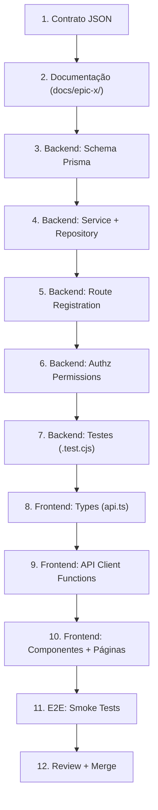
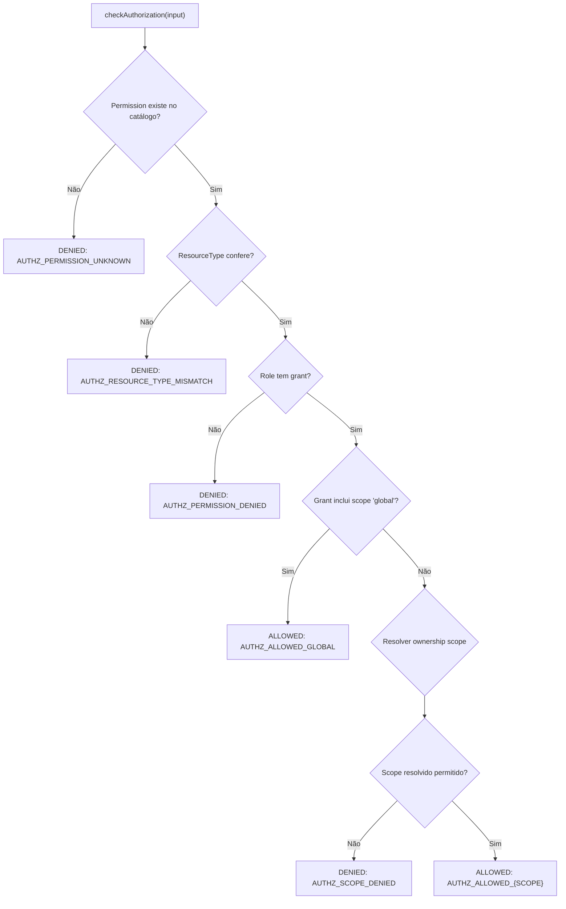
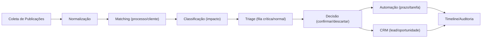

# Lexora — Workflow de Desenvolvimento de Features

## Propósito

Definir o fluxo completo de desenvolvimento de uma nova feature no Lexora, desde o planejamento com contrato JSON até a integração com pipelines existentes. Este skill garante consistência entre backend, frontend e documentação.

---

## 1. Estrutura de Epics e Documentação

### 1.1 Diretório `docs/`

Cada epic/fase possui uma pasta em [docs/](file:///c:/Users/tomke/app%20Juridico/docs) com 5 arquivos padrão:

```
docs/
├── epic-a/            # Publicações/Intimações Automáticas
│   ├── overview.md    # Objetivo, escopo, arquitetura, diagrama
│   ├── contracts.md   # Mapeamento contrato ↔ implementação
│   ├── qa.md          # Critérios de aceitação e testes
│   ├── runbook.md     # Operação, troubleshooting
│   └── changelog.md   # Histórico de mudanças
├── epic-b/            # Finance
├── epic-cde/          # Documentos, Tasks, Deadlines
├── epic-fgh/          # CRM, Clients, Communication
├── epic-ij/           # Triage avançada, Automação
├── epic-klm/          # BI, Timesheet, Mobile
├── fase-1-foundation/
├── fase-2-commercial-governance/
├── fase-3-platform-console/
├── fase-3-rollout-enforcement/
├── publication-origin-rework/
└── skills/            # Skills para agentes IA
```

### 1.2 Exemplo de `overview.md`

Veja [epic-a/overview.md](file:///c:/Users/tomke/app%20Juridico/docs/epic-a/overview.md):

```markdown
# Epic A — Publicações/Intimações Automáticas

## Objetivo
Entregar ingestão automática de publicações com matching operacional...

## Escopo fim a fim
- Coleta automática agendada às 06:00, 12:00 e 18:00.
- ...

## Arquitetura
- `backend/src/jobs/*`: orquestração de job agendado
- `backend/src/publications/ingestion/*`: coleta e normalização
- ...

## Ordem de integração
1. contratos + tipos
2. ingestão
3. matching + classificação
4. automação de prazo/tarefa
5. auditoria + reprocessamento
6. frontend
7. testes + documentação + hardening
```

---

## 2. Contratos JSON — Contract-First Development

### 2.1 Os 12 contratos do projeto

Todos em [contracts/](file:///c:/Users/tomke/app%20Juridico/contracts):

| Contrato | Tamanho | Domínio |
|----------|---------|---------|
| [epic-a-publications.contract.json](file:///c:/Users/tomke/app%20Juridico/contracts/epic-a-publications.contract.json) | 6.5 KB | Publicações, matching, classificação, automação |
| [epic-b-finance.contract.json](file:///c:/Users/tomke/app%20Juridico/contracts/epic-b-finance.contract.json) | 8.5 KB | Billing, collections, reconciliation |
| [epic-fgh.contract.json](file:///c:/Users/tomke/app%20Juridico/contracts/epic-fgh.contract.json) | 14 KB | CRM, Clients, Communication |
| [epic-ij.contract.json](file:///c:/Users/tomke/app%20Juridico/contracts/epic-ij.contract.json) | 16 KB | Triage avançada, automação |
| [epic-k.contract.json](file:///c:/Users/tomke/app%20Juridico/contracts/epic-k.contract.json) | 5.2 KB | BI Analytics |
| [epic-l-bi.contract.json](file:///c:/Users/tomke/app%20Juridico/contracts/epic-l-bi.contract.json) | 3.8 KB | BI Dashboards |
| [epic-m.contract.json](file:///c:/Users/tomke/app%20Juridico/contracts/epic-m.contract.json) | 4.7 KB | Mobile |
| [fase-2-commercial-governance.contract.json](file:///c:/Users/tomke/app%20Juridico/contracts/fase-2-commercial-governance.contract.json) | 2.3 KB | Governança comercial |
| [fase-3-platform-console.contract.json](file:///c:/Users/tomke/app%20Juridico/contracts/fase-3-platform-console.contract.json) | 2.6 KB | Console da plataforma |
| [fase-3-rollout-enforcement.contract.json](file:///c:/Users/tomke/app%20Juridico/contracts/fase-3-rollout-enforcement.contract.json) | 1.9 KB | Rollout e enforcement |
| [foundation-multitenant.contract.json](file:///c:/Users/tomke/app%20Juridico/contracts/foundation-multitenant.contract.json) | 7.5 KB | Multi-tenancy, company, membership |
| [publication-origin-rework.contract.json](file:///c:/Users/tomke/app%20Juridico/contracts/publication-origin-rework.contract.json) | 6 KB | Rework de origens de publicação |

### 2.2 Anatomia de um Contract JSON

Veja [epic-a-publications.contract.json](file:///c:/Users/tomke/app%20Juridico/contracts/epic-a-publications.contract.json):

```json
{
  "epic": "Epic A — Publicacoes/Intimacoes Automaticas",
  "version": "2026-05-20",
  "entities": {
    "normalizedPublication": {
      "description": "Payload canonico produzido apos coleta e normalizacao.",
      "idempotencyKey": "sourceType|sourceReference|occurredAt|normalizedHash",
      "fields": {
        "sourceType": "cnj|cpf|cnpj|oab|processo|diario",
        "status": "novo|processado|falha|reprocessado"
      }
    },
    "matchingResult": {
      "description": "Resultado deterministico de match contra processo/cliente.",
      "fields": {
        "matchStatus": "matched|partial|ambiguous|unmatched",
        "confidence": "high|medium|low"
      }
    }
  },
  "examples": {
    "normalizedPublication": { /* exemplo completo */ },
    "matchingResult": { /* exemplo completo */ }
  },
  "errors": {
    "PUB_DUPLICATE": "Publicacao ignorada por idempotencia.",
    "PUB_MATCH_AMBIGUOUS": "Mais de um candidato valido encontrado."
  },
  "pipelineOrder": ["collect", "normalize", "match", "classify", "triage", "automate", "audit", "reprocess"]
}
```

### 2.3 Como criar um contrato para uma nova feature

1. Crie o arquivo: `contracts/<nome-da-feature>.contract.json`
2. Defina a estrutura obrigatória:

```json
{
  "epic": "Nome descritivo da feature",
  "version": "YYYY-MM-DD",
  "entities": {
    "<entityName>": {
      "description": "Descrição do propósito da entidade.",
      "idempotencyKey": "campo1|campo2 (se aplicável)",
      "fields": {
        "<fieldName>": "tipo|enum_values"
      }
    }
  },
  "examples": {
    "<entityName>": { /* exemplo completo com todos os campos */ }
  },
  "errors": {
    "PREFIX_ERROR_CODE": "Mensagem descritiva do erro."
  }
}
```

> [!IMPORTANT]
> O contrato é a **fonte de verdade** para tipagem. Interfaces no frontend (`api.ts`) e tipos no backend devem espelhar exatamente os campos definidos no contrato.

---

## 3. Ordem de Implementação

### 3.1 Fluxo canônico



### 3.2 Detalhamento de cada passo

#### Passo 1 — Contrato JSON
- Defina entidades, campos, exemplos e códigos de erro
- Commit: `contracts/<feature>.contract.json`

#### Passo 2 — Documentação
- Crie `docs/<epic>/overview.md` com objetivo, escopo e arquitetura
- Crie `docs/<epic>/contracts.md` mapeando contrato → implementação
- Crie `docs/<epic>/qa.md` com critérios de aceitação

#### Passo 3 — Schema Prisma
```prisma
model NomeDaEntidade {
  id        Int      @id @default(autoincrement())
  status    String
  createdAt DateTime @default(now())
  updatedAt DateTime @updatedAt
}
```
```powershell
cd backend
npm run prisma:migrate:dev -- --name add_nome_da_entidade
npm run prisma:generate
```

#### Passo 4 — Service + Repository
Criar no padrão do projeto:
```
backend/src/<module>/
├── <module>.service.ts          # Lógica de negócio
├── <module>.types.ts            # Tipos e interfaces
├── <module>.validators.ts       # Validações de contrato
├── prisma-<module>.repository.ts  # Implementação Prisma
├── in-memory-<module>.repository.ts  # Para testes
└── index.ts                     # Re-exports
```

#### Passo 5 — Route Registration
Crie `register-<module>-routes.ts` seguindo o padrão em [register-timesheet-routes.ts](file:///c:/Users/tomke/app%20Juridico/backend/src/timesheet/http/register-timesheet-routes.ts):

```typescript
import type express from 'express';
import { ensureAuthorized } from '../../authz/guards/authz.guard';

type UserToken = { sub: number; role: string; email: string };

export function registerXxxRoutes(input: {
  app: express.Express;
  getUserFromReq: (req: express.Request) => UserToken | null;
  // ... dependências adicionais
}) {
  input.app.post('/xxx', async (req, res) => {
    const decoded = input.getUserFromReq(req);
    if (!decoded) return res.status(401).send({ message: 'Token não fornecido' });

    try {
      ensureAuthorized({
        actor: { userId: decoded.sub, role: decoded.role },
        permissionKey: 'xxx.create',
        resourceType: 'xxx',
      });
      // ... lógica
    } catch (error: any) {
      res.status(403).send({ message: error?.message ?? 'Acesso negado' });
    }
  });
}
```

Registre em [main.ts](file:///c:/Users/tomke/app%20Juridico/backend/src/main.ts) (no final, ~L8100+):

```typescript
import { registerXxxRoutes } from './xxx/http/register-xxx-routes';

registerXxxRoutes({
  app,
  getUserFromReq,
  // ... dependências
});
```

#### Passo 6 — Authz Permissions
Adicione permissões em [permissions.ts](file:///c:/Users/tomke/app%20Juridico/backend/src/authz/rbac/permissions.ts) (detalhes na seção 7).

#### Passo 7 — Testes Backend
Crie `<module>.test.cjs` usando `node:test` + `InMemoryRepository`.

#### Passo 8 — Types Frontend
Adicione interfaces em [api.ts](file:///c:/Users/tomke/app%20Juridico/frontend/src/api.ts):

```typescript
export interface ApiXxx {
  id: number;
  status: string;
  // ... campos do contrato
}
```

#### Passo 9 — API Client Functions
Adicione funções em [api.ts](file:///c:/Users/tomke/app%20Juridico/frontend/src/api.ts):

```typescript
export async function createXxx(data: CreateXxxInput): Promise<ApiXxx> {
  return apiClient('/xxx', { method: 'POST', body: data });
}

export async function listXxx(): Promise<ApiXxx[]> {
  return apiClient('/xxx');
}
```

#### Passo 10 — Componentes + Páginas
Componentes React seguindo design system do Lexora (ver `lexora-design-system.md`).

#### Passo 11 — Smoke Tests
Crie `frontend/<feature>.smoke.test.ts`.

---

## 4. Branch Naming Convention

### 4.1 Formato

```
<tipo>/<epic-ou-modulo>/<descricao-curta>
```

### 4.2 Tipos de branch

| Tipo | Uso | Exemplo |
|------|-----|---------|
| `feature/` | Nova funcionalidade | `feature/epic-k/bi-dashboard-filters` |
| `fix/` | Correção de bug | `fix/finance/billing-duplicate-charge` |
| `refactor/` | Refatoração sem mudança de comportamento | `refactor/main/extract-crm-routes` |
| `docs/` | Apenas documentação | `docs/epic-a/update-pipeline-diagram` |
| `test/` | Apenas testes | `test/authz/add-portfolio-scope-tests` |
| `chore/` | Configuração, CI, dependências | `chore/deps/upgrade-prisma-v5` |

### 4.3 Exemplos reais

```
feature/epic-b/finance-reconciliation-webhook
feature/fase-3/platform-console-company-crud
fix/epic-a/publication-matching-ambiguous-fallback
refactor/main/extract-timesheet-routes
docs/skills/add-testing-strategy
```

---

## 5. PR Checklist

### 5.1 Antes de abrir o PR

- [ ] **Contrato**: Existe `contracts/*.contract.json` atualizado para a feature?
- [ ] **Documentação**: `docs/<epic>/` atualizado (overview, contracts, qa)?
- [ ] **Schema**: Migration Prisma criada e testada localmente?
- [ ] **Build backend**: `npm --prefix backend run build` passa?
- [ ] **Testes backend**: `node --test backend/src/**/*.test.cjs` passa?
- [ ] **Lint frontend**: `npm --prefix frontend run lint` passa?
- [ ] **Build frontend**: `npm --prefix frontend run build` passa?
- [ ] **Smoke tests**: Pelo menos os smoke tests relevantes passam?

### 5.2 No corpo do PR

```markdown
## Descrição
<!-- O que essa mudança faz e por quê -->

## Contrato
<!-- Link para o contract.json atualizado -->

## Tipo de mudança
- [ ] Feature nova
- [ ] Bug fix
- [ ] Refatoração
- [ ] Documentação

## Módulos alterados
- [ ] Backend routes
- [ ] Backend services
- [ ] Authz permissions
- [ ] Frontend API client
- [ ] Frontend components
- [ ] Prisma schema
- [ ] Testes

## Screenshots (se frontend)
<!-- Capturas de tela da UI -->

## Checklist
- [ ] Sem `console.log` em código de produção
- [ ] Tipos do contrato refletidos em api.ts
- [ ] Permissões authz configuradas para os 4 roles
- [ ] InMemoryRepository criado para testes
- [ ] Testes cobrem happy path + 1 caso de erro
```

---

## 6. Mock Data para Novas Entidades

### 6.1 Padrão existente

Dados mock ficam em [main.ts](file:///c:/Users/tomke/app%20Juridico/backend/src/main.ts) (L116-196) como `const` arrays:

```typescript
// Padrão: const devMock<Entity> = [{...}] as const;
const devMockUsers = [
  { id: 1, email: 'admin@juridico.com', password: '123456', role: 'ADM' },
  // ...
] as const;

const devMockProcesses = [
  { id: 3, title: '...', processNumber: '...', client: '...', phase: '...', status: '...', ownerId: 1 },
  // ...
] as const;
```

### 6.2 Como adicionar mock data para nova entidade

1. **Declare a constante** no início de `main.ts` (próximo às existentes, ~L130+):

```typescript
const devMockNewEntities = [
  { id: 1, name: 'Entity Alpha', status: 'active', ownerId: 1 },
  { id: 2, name: 'Entity Beta', status: 'pending', ownerId: 2 },
] as const;
```

2. **Crie helper de acesso** com filtro por role:

```typescript
function getDevMockNewEntitiesForRole(decoded: UserToken) {
  if (decoded.role === 'ADM') return [...devMockNewEntities];
  return devMockNewEntities.filter(e => e.ownerId === decoded.sub);
}
```

3. **Use na rota** quando `devMockEnabled`:

```typescript
app.get('/new-entities', (req, res) => {
  const decoded = getUserFromReq(req);
  if (!decoded) return res.status(401).send({ message: 'Token inválido' });

  if (devMockEnabled) {
    return res.json(getDevMockNewEntitiesForRole(decoded));
  }

  // Lógica real com Prisma...
});
```

> [!TIP]
> Mantenha os IDs dos mock data compatíveis com os relacionamentos existentes. Use `ownerId: 1` (ADM), `ownerId: 2` (ADV) para garantir consistência com `devMockUsers`.

---

## 7. Modelo de Permissões (RBAC/Authz)

### 7.1 Estrutura do sistema de autorização

```
backend/src/authz/
├── rbac/
│   └── permissions.ts           # Catálogo de permissões + grants por role
├── policies/
│   ├── authz.check.ts           # Motor de decisão
│   ├── authz.types.ts           # Tipos (AuthzActor, AuthzDecision, etc.)
│   └── ownership.ts             # Resolução de scopes (own/team/portfolio/global)
├── guards/
│   └── authz.guard.ts           # Guard para rotas (ensureAuthorized)
├── company-status/
│   └── company-status-authz-enforcer.ts  # Regras por status da company
└── finance/
    └── permissions.ts           # Permissões específicas de finance
```

### 7.2 Os 4 roles

| Role | Código | Acesso |
|------|--------|--------|
| Administrador | `ADM` | Global — acesso total |
| Advogado | `ADV` | Own + Team + Portfolio |
| Financeiro | `FIN` | Finance global + exports |
| Atendimento | `ATD` | Team — atendimentos e tarefas |

### 7.3 Scopes de acesso

Definidos em [permissions.ts](file:///c:/Users/tomke/app%20Juridico/backend/src/authz/rbac/permissions.ts#L4-L8):

```typescript
export const authzScopes = ['own', 'team', 'portfolio', 'global', 'denied'] as const;
export const manageableAuthzScopes = ['own', 'team', 'portfolio', 'global'] as const;
```

| Scope | Significado |
|-------|------------|
| `own` | Apenas recursos do próprio usuário |
| `team` | Recursos da equipe do usuário |
| `portfolio` | Recursos do portfólio atribuído |
| `global` | Todos os recursos |
| `denied` | Acesso negado |

### 7.4 Resource Types existentes

```typescript
export const authzResourceTypes = [
  'task', 'attendance', 'portfolio', 'team',
  'productivity', 'export', 'ai', 'bi',
  'timesheet', 'mobile'
] as const;
```

### 7.5 Como adicionar novas permissões

**Passo 1** — Adicione ao catálogo em [permissions.ts](file:///c:/Users/tomke/app%20Juridico/backend/src/authz/rbac/permissions.ts#L13-L55):

```typescript
export const authzPermissionCatalog = [
  // ... permissões existentes ...
  
  // Novas permissões
  { key: 'newEntity.view', resourceType: 'newEntity', sensitive: false, requiresAudit: false },
  { key: 'newEntity.create', resourceType: 'newEntity', sensitive: false, requiresAudit: true },
  { key: 'newEntity.update', resourceType: 'newEntity', sensitive: false, requiresAudit: true },
  { key: 'newEntity.delete', resourceType: 'newEntity', sensitive: true, requiresAudit: true },
] as const;
```

**Passo 2** — Adicione o resource type:

```typescript
export const authzResourceTypes = [
  'task', 'attendance', /* ... */, 'newEntity'
] as const;
```

**Passo 3** — Configure grants por role na matriz de permissões (`permissions/matrix.ts`):

```typescript
// ADM: global em tudo
// ADV: own + team + portfolio
// FIN: global em exports, denied em operacional
// ATD: team scope
```

**Passo 4** — Use o guard nas rotas:

```typescript
ensureAuthorized({
  actor: { userId: decoded.sub, role: decoded.role },
  permissionKey: 'newEntity.create',
  resourceType: 'newEntity',
  resourceId: req.params.id,
  context: { ownerUserId: ownerUserId },
});
```

**Passo 5** — Adicione testes:

```javascript
test('authz allows ADM to create newEntity globally', async () => {
  const { checkAuthorization } = require(authzCheckPath);
  const decision = checkAuthorization({
    actor: { userId: 1, role: 'ADM' },
    permissionKey: 'newEntity.create',
    resourceType: 'newEntity',
  });
  assert.equal(decision.allowed, true);
  assert.equal(decision.scope, 'global');
});

test('authz denies ATD from deleting newEntity', async () => {
  const { checkAuthorization } = require(authzCheckPath);
  const decision = checkAuthorization({
    actor: { userId: 4, role: 'ATD' },
    permissionKey: 'newEntity.delete',
    resourceType: 'newEntity',
  });
  assert.equal(decision.allowed, false);
});
```

### 7.6 Fluxo de decisão do authz



---

## 8. Integração com Pipelines Existentes

### 8.1 Publicações → Triage → CRM

O fluxo principal do Lexora é:



### 8.2 Onde novas features se conectam

| Se sua feature envolve... | Conecte em... |
|--------------------------|---------------|
| Dados de publicação | Pipeline de normalização/matching |
| Prazos/tarefas automatizados | `CreateDeadlineFromPublicationService` |
| Dados de cliente | CRM + ClientPortalService |
| Métricas/relatórios | BI (ProductivityExecutiveMetricsService) |
| Comunicação com cliente | ClientCommunicationService |
| Valores financeiros | Finance module (registerFinanceRoutes) |
| Auditoria | CrmAuditService (genérico, usado por todos) |

### 8.3 Serviços compartilhados

Instanciados em [main.ts](file:///c:/Users/tomke/app%20Juridico/backend/src/main.ts) (~L404-461):

```typescript
// Auditoria — usado por CRM, Documents, Finance
const crmAuditService = new CrmAuditService(createPrismaCrmAuditRepository({...}));

// CRM
const crmProspectingService = new CrmProspectingService({...});
const crmOpportunityConversionService = new CrmOpportunityConversionService({...});

// Clientes
const clientPortalService = new ClientPortalService({...});
const clientConsentService = new ClientConsentService({...});
const clientCommunicationService = new ClientCommunicationService({...});

// Deadlines & Tasks
const deadlineRiskService = new DeadlineRiskService();
const deadlineAuditService = new DeadlineAuditService();
const documentChecklistService = new ProceduralDocumentChecklistService();
```

### 8.4 Padrão de registro de rotas extraídas

Todas as rotas extraídas seguem o padrão `registerXxxRoutes()`. Veja como são registradas em [main.ts:L8108-8170](file:///c:/Users/tomke/app%20Juridico/backend/src/main.ts#L8108-L8170):

```typescript
// 9 módulos já extraídos:
registerFinanceRoutes({ app, prisma, getUserFromReq, devMockEnabled });
registerPlatformBillingRoutes({ app, prisma, getUserFromReq });
registerPlatformActionsRoutes({ app, prisma, getUserFromReq });
registerPlatformConsoleRoutes({ app, prisma, getUserFromReq });
registerEpicIjRoutes({ app, prisma, getUserFromReq });
registerAiRoutes({ app, getUserFromReq });
registerBiRoutes({ app, getUserFromReq, productivityService, financeService, snapshotService, exportService, ... });
registerTimesheetRoutes({ app, getUserFromReq, repository: timeEntryRepository });
registerMobileRoutes({ app, prisma, getUserFromReq, repository: timeEntryRepository });
```

---

## Anti-padrões

| ❌ Evite | ✅ Prefira |
|----------|-----------|
| Começar pelo frontend sem contrato | Definir contrato JSON primeiro |
| Adicionar rotas direto no main.ts | Criar `registerXxxRoutes` em arquivo separado |
| Tipos no frontend sem contrato correspondente | Derivar interfaces de `api.ts` do contrato |
| Permissões hardcodadas nas rotas | Usar `ensureAuthorized` com permission keys |
| Mock data espalhado em vários arquivos | Centralizar em `main.ts` no bloco de dev mocks |
| PR sem documentação em `docs/` | Criar/atualizar overview.md e contracts.md |
| Branches sem prefixo de tipo | Usar `feature/`, `fix/`, `refactor/` |
| Testes que dependem de Prisma real | Criar InMemoryRepository para testes |

---

## Checklist para Nova Feature

- [ ] **Contrato**: `contracts/<feature>.contract.json` criado com entities, examples e errors?
- [ ] **Docs**: `docs/<epic>/overview.md` atualizado com escopo e arquitetura?
- [ ] **Schema**: Migration Prisma criada e aplicada localmente?
- [ ] **Repository**: InMemoryRepository + PrismaRepository implementados?
- [ ] **Service**: Lógica de negócio isolada em service class?
- [ ] **Validators**: Validações de contrato com error codes do JSON?
- [ ] **Routes**: `registerXxxRoutes` criado e registrado em main.ts?
- [ ] **Authz**: Permissões adicionadas no catálogo + grants por role?
- [ ] **Tests backend**: `.test.cjs` com InMemoryRepository cobrindo happy path + erros?
- [ ] **Types frontend**: Interfaces adicionadas em `api.ts`?
- [ ] **API client**: Funções `fetchXxx`, `createXxx`, etc. adicionadas em `api.ts`?
- [ ] **Componentes**: Páginas e componentes React criados?
- [ ] **Smoke test**: `.smoke.test.ts` cobrindo o fluxo principal?
- [ ] **Branch**: Nomeada como `feature/<epic>/<descrição>`?
- [ ] **PR**: Checklist preenchido e contrato linkado?
